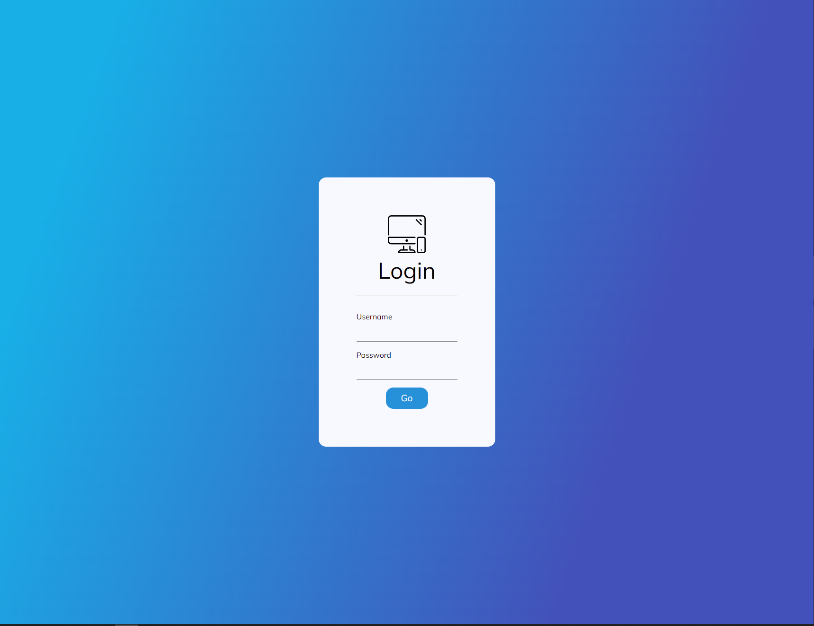

# Login Page

## Description

For Practice I wanted to create a minimal login page. I wanted to test my CSS skills with the minimal looks. I added a gradient background, with the login form in front of it. When the mouse hovers over the login button, it eases into a darker color. I will most likey use this design effort into some future projects with back-end support.

